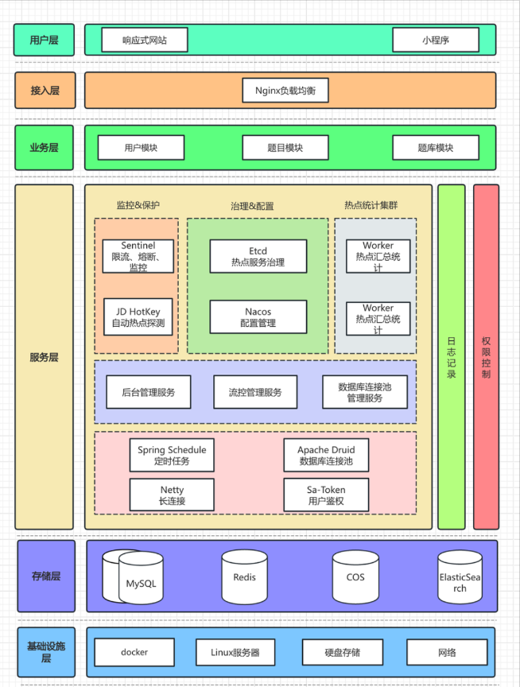

### question_search(智能刷题学习平台)
## 项目介绍
    基于Next.js服务端渲染 + Spring Boot + Redis + MySQL + Elasticsearch 的智能刷题学习平台。
    管理员可以创建题库、题目和题解，并批量关联题目到题库；用户可以注册登录、分词检索题目、在线刷题并查看刷题记录日历等。
## 项目阶段
    1.开发基础的刷题平台，进行Spring Boot应用的快速开发
    2.Redis缓存和高级数据结构、Elasticsearch搜索引擎、Druid连接池、并发编程、热Key探测应用
    3.基于Sentinel进行网站流量控制和熔断、基于Nacos实现动态的IP黑白名单、基于Sa-Token实现通断登录冲突检测、基于Reids实现分级反爬虫策略等。
## 技术选型
    Java Spring Boot框架 + Maven多模块构建
    MySQL数据库 + MyBatis-Plus框架 + MyBatis X
    Redis分布式缓存 + Caffeine本地缓存
    Redission分布式锁 + BitMap + BloomFilter
    Elasticsearch搜索引擎
    Druid数据库连接池 + 并发编程
    Sa-Token权限控制
    HotKey热点探测
    Sentinel流量控制
    Nacos配置中心
## 架构设计

